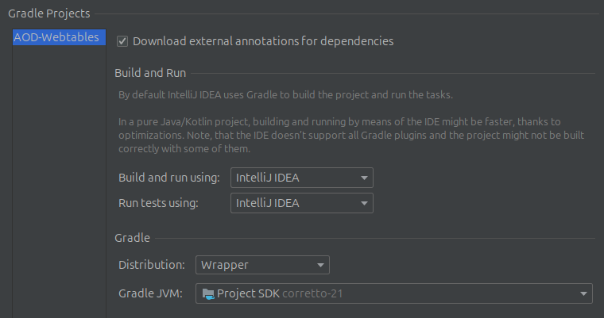

# <u>AODs on Webtables</u>

Order Dependencies (ODs) define relationships between the sorted values of attributes in a dataset, where the order of one attribute set determines the order of another. Applied to WebTables, which often contain noisy and unstructured data from the web, ODs help ensure consistency and uncover hidden patterns.

[](#)
[](#)
[](#)
[](#)
[](#)
[](#)


## Acknowledgements

- [Original Algorithm](https://github.com/chenjixuan20/AOD)


## Run Locally

Clone the project

```bash
  git clone https://github.com/Tunaccino/AOD-Webtables.git
```

Go to

```bash
  File|ProjectStructure
```
And change the SDK to Java 21 and Language Level to 15. Then reload Gradle

Go to

```bash
  File|Settings|Build,Execution,Deplyoment|Build Tools|Gradle
```
And Change the Run Options to



Create two empty Folders Stage 1 and Stage 2 in

```bash
  data/Stage 1
  data/Stage 2
```

Run the GUI

```bash
  src/main/java/leveretconey/gui/Discoverer.java
```

## Distribution
To run the program using distribution run

- On the service side 
```bash
  src/main/java/leveretconey/dependencyDiscover/Parallel/distributed/Service/AODServiceImplementation.java
```

- On the client side 
```bash
  src/main/java/leveretconey/dependencyDiscover/Parallel/distributed/Client/AODClient.java
```

- For the client side it is advised to use the GUI though

## Experiment
The experiments shown in the Thesis can be reproduced using the code in

```bash
  src/main/java/leveretconey/exp/exp8/AODWebtables.java
```

The Datasets used are from the

- [Web Data Commons](http://webdatacommons.org/)

Note that the experiments where run of filterd formatted Versions.

These can be created using the GUI.

## FAQ

#### Can't enter a Path into the GUI

It is important to first select a run method, e.g parallel.

#### Which Systems are supported 

The project is build on Linux, and it is highly recommended to use Linux when using it.

If you are using Windows please use the intended branch
```bash
https://github.com/Tunaccino/AOD-Webtables/tree/windows
```

#### Error message out of Cache
The Cache size used can be reduced by lowering the value of maxSpCache in
```bash
src/main/java/leveretconey/cocoa/multipleStandard/DFSDiscovererWithMultipleStandard.java
```
Only do this if you run out of cache as it can lower the algorithm's performance!


⠀⠀⠀⠀⠀⠀⠀⠀⠀⠀⠀⠀⠀⢀⣀⡀⠀⠀⠀⠀⠀⠀⠀⠀⠀⠀⠀⠀⠀⠀⠀⠀⠀⠀⠀⠀⠀⠀⠀⠀⠀⠀⠀⠀⠀⠀⠀⠀⠀⠀⠀⠀⠀⠀⠀
⠀⠀⠀⠀⠀⠀⠀⠀⠀⠀⠀⠀⢠⣿⠟⠻⣦⡀⠀⠀⠀⠀⠀⠀⠀⠀⠀⠀⠀⠀⠀⠀⠀⠀⠀⠀⠀⠀⠀⠀⠀⠀⠀⠀⠀⠀⠀⠀⠀⠀⠀⠀⠀⠀⠀
⠀⠀⠀⠀⠀⠀⠀⠀⠀⠀⠀⠀⣼⣿⠀⠀⠈⠻⣦⣄⠀⠀⠀⠀⠀⠀⠀⠀⠀⠀⠀⠀⠀⠀⠀⠀⠀⠀⠀⠀⠀⠀⠀⠀⠀⠀⠀⣀⣴⣶⣦⡀⠀⠀⠀
⠀⠀⠀⠀⠀⠀⠀⠀⠀⠀⠀⠀⡿⡇⠀⠀⠀⠀⠈⠙⢷⣄⠀⠀⠀⠀⠀⠀⠀⠀⠀⠀⠀⠀⠀⠀⠀⠀⠀⠀⠀⠀⠀⠀⣀⣤⠾⠋⠁⢸⣿⡇⠀⠀⠀
⠀⠀⠀⠀⠀⠀⠀⠀⠀⠀⠀⠀⣇⡇⠀⠀⠀⠀⠀⠀⠀⠙⢷⣆⡀⠀⠀⠀⠀⠀⠀⠀⠀⠀⠀⠀⠀⠀⠀⠀⠀⢀⣤⡾⠛⠁⠀⠀⠀⣿⣼⠀⠀⠀⠀
⠀⠀⠀⠀⠀⠀⠀⠀⠀⠀⠀⠘⡏⣷⠀⠀⠀⠀⠀⠀⠀⠀⠀⠙⢿⣦⠀⠀⠀⠀⠀⠀⠀⠀⠀⠀⠀⠀⢀⣤⡾⠛⠁⠀⠀⠀⠀⠀⣸⡿⣿⠂⠀⠀⠀
⠀⠀⠀⠀⠀⠀⠀⠀⠀⠀⠀⠀⣇⣿⠀⠀⠀⠀⠀⠶⠶⠶⠶⠶⠶⠿⠷⠶⠶⠤⣤⣤⣀⣀⡀⢀⣤⡾⠛⠁⠀⠀⠀⠀⠀⠀⠀⢠⣿⢣⡟⠀⠀⠀⠀
⠀⠀⠀⠀⠀⠀⠀⠀⠀⠀⠀⠀⣿⡇⠀⠀⠀⠀⠀⠀⠀⠀⠀⠀⠀⠀⠀⠀⠀⠀⠀⠀⠈⠉⣽⠟⠁⠀⠀⠀⠀⠀⠀⠀⠀⠀⠀⣼⡷⣸⠇⠀⠀⠀⠀
⠀⠀⠀⠀⠀⠀⠀⠀⠀⠀⠀⠀⣿⡇⠀⠀⠀⠀⠀⠀⠀⠀⠀⠀⠀⠀⠀⠀⠀⠀⠀⠀⠀⠀⠀⠀⠀⠀⠀⠀⠀⠀⠀⠀⠀⠀⢀⣿⢣⡿⠁⠀⠀⠀⠀
⠀⠀⠀⠀⠀⠀⠀⠀⠀⠀⠀⠀⡿⠀⠀⠀⠀⠀⠀⠀⠀⠀⠀⠀⠀⠀⠀⠀⠀⠀⠀⠀⠀⠀⠀⠀⠀⠀⠀⠀⠀⠀⠀⠀⠀⠀⢸⣿⣼⠃⠀⠀⠀⠀⠀
⠀⠀⠀⠀⠀⠀⠀⠀⠀⠀⠀⣸⠇⠀⣀⣀⣀⠀⠀⠀⠀⠀⠀⠀⠀⠀⠀⠀⠀⠀⠀⠀⠀⠀⠀⠀⠀⠀⠀⠀⠀⠀⠀⠀⠀⠀⢸⣿⡏⠀⠀⠀⠀⠀⠀
⠀⠀⠀⠀⠀⠀⠀⠀⣀⣤⣿⣿⡾⠛⠉⣉⣽⣿⣶⣤⡀⠀⠀⠀⠀⠀⠀⠀⠀⣠⣴⠶⠛⢛⣿⣿⣷⣶⣤⣀⠀⠀⠀⠀⠀⠀⢸⣿⡀⠀⠀⠀⠀⠀⠀
⠀⠀⠀⠀⠀⢰⣾⠛⢉⣵⡟⣃⣤⣶⣿⣿⣿⣿⣿⣿⣷⡄⠀⠀⠀⠀⠀⣠⣾⠏⣡⣴⣾⣿⣿⣿⣿⣿⣿⣿⣷⡄⠀⠀⠀⠀⢈⡹⣇⠀⠀⠀⠀⠀⠀
⠀⠀⠀⠀⠀⠀⠙⣷⣾⣿⣿⣿⣿⣿⣿⣿⣿⣿⣿⣿⣿⣿⣀⣀⣀⣀⣰⣿⣷⣿⣿⣿⣿⣿⣿⣿⣿⣿⣿⣿⣿⣿⣦⠶⠖⠲⠾⣿⣿⣦⠀⠀⠀⠀⠀
⠀⠀⠀⠀⣠⣴⡾⠋⣿⣿⣿⣿⣿⣿⣿⣿⣿⣿⣿⣿⣿⣿⠟⠛⠻⠿⣿⣿⣿⣿⣿⣿⣿⣿⣿⣿⣿⣿⣿⣿⣿⠟⠀⠀⠀⠀⠀⠈⠙⢿⣄⠀⠀⠀⠀
⠀⠀⣿⡛⠉⠁⠀⠀⢿⣿⣿⣿⣿⣿⣿⣿⣿⣿⣿⣿⣿⡏⠀⠀⠀⠀⢿⣿⣿⣿⣿⣿⣿⣿⣿⣿⣿⣿⣿⣿⣿⠀⠀⠀⠀⠀⠀⠀⠀⠀⠙⢷⣄⠀⠀
⠀⠀⣾⣷⣦⣀⠀⠀⠈⢿⣿⣿⣿⣿⣿⣿⣿⣿⣿⣿⠏⠀⠀⠀⠀⠀⠘⣿⣿⣿⣿⣿⣿⣿⣿⣿⣿⣿⣿⣿⣿⣆⠀⠀⠀⠀⠀⠀⠀⠀⠀⠀⠻⣧⠀
⠀⡀⠈⠻⢿⣿⣿⣷⠆⠀⠙⠻⠿⣿⣿⡿⢿⣿⠋⠀⠀⠀⣴⠇⠀⠀⠀⠈⣿⣿⣿⣿⣿⣿⣿⣿⣿⣿⣿⣿⣿⢿⡄⠀⠀⠀⠀⠀⠀⠀⠀⠀⠀⢹⡆
⠀⠻⣟⠛⠛⠛⠉⠁⠀⠀⠀⠀⠀⠀⠀⠀⠿⣿⣆⣀⣠⣼⢿⣧⠀⠀⠀⢀⣿⠿⢿⣿⣿⣿⣿⣿⣿⣿⠿⣛⠹⣮⣿⣄⠀⠀⠀⠀⠀⠀⠀⠀⠀⠈⣷
⠀⠀⠈⠻⢦⣤⣀⣀⠀⠀⠀⠀⠀⠀⠀⠀⠀⠈⠛⢩⠿⠻⣯⢻⣷⣶⣿⡿⠋⠀⠀⠀⠉⠉⠉⠉⠁⠀⣐⣭⣾⡿⠋⢻⣧⠀⠀⠀⠀⠀⠀⠀⠀⠀⣿
⠀⠀⠀⢀⣰⣿⣻⡏⠀⠀⠀⠀⠀⠀⠀⠀⠀⠀⠀⠀⠀⠀⠀⠀⠀⠀⠀⠀⠀⠀⠀⠀⠀⠀⠀⠀⠀⠀⣴⡿⠛⣍⠡⠁⠀⠀⠀⠀⠀⠀⠀⠀⠀⢠⡟
⠀⠀⠀⠛⣿⣿⠟⠀⠀⠀⠀⠀⠀⠀⠀⠀⠀⠀⠀⠀⠀⠀⠀⠀⠀⠀⠀⠀⠀⠀⠀⠀⠀⠀⠀⠀⣤⡾⠋⠀⠀⠀⠀⠀⠀⠀⠀⠀⠀⠀⠀⠀⣠⡿⠁
⠀⠀⠀⢐⣿⡿⠀⠀⠀⠀⠀⠀⠀⠀⠀⠀⠀⠀⠀⠀⠀⠀⠀⠀⠀⠀⠀⠀⠀⠀⠀⠀⠀⠀⠀⠀⠀⠀⠀⠀⠀⠀⠀⠀⠀⠀⠀⠀⠀⠀⢀⣴⠟⠀⠀
⠀⠀⠀⣼⣿⠇⠀⠀⠀⠀⠀⠀⠀⠀⠀⠀⠀⠀⠀⠀⠀⠀⠀⠀⠀⠀⠀⠀⠀⠀⠀⠀⠀⠀⠀⠀⠀⠀⠀⠀⠀⠀⠀⠀⠀⠀⠀⠀⠀⣠⡾⠃⠀⠀⠀
⠀⠀⠀⣸⡟⠀⠀⠀⠀⠀⠀⠀⠀⠀⠀⠀⠀⠀⠀⠀⠀⠀⠀⠀⠀⠀⠀⠀⠀⠀⠀⠀⠀⠀⠀⠀⠀⠀⠀⠀⠀⠀⠀⠀⠀⠀⠀⢀⣶⡟⠀⠀⠀⠀⠀⠀⠀⠀⠀⠀⠀⠀⠀⠀⠀⠀⠀⠀⠀⠀⠀⠀⠀⠀⠀⠀⠀⠀⠀⠀⠀⠀⠀⠀⠀⠀⠀⠀⠀⠀⠀⠀⠀⠀⠀⠀⠀

